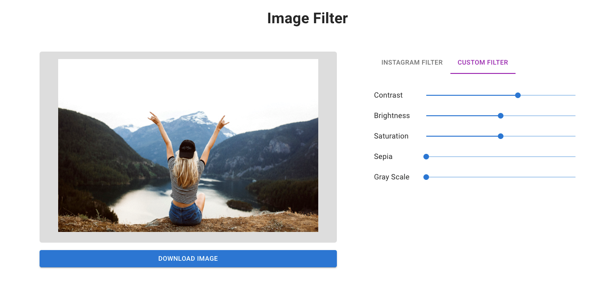

This project was bootstrapped with [vite](https://vitejs.dev/guide/#scaffolding-your-first-vite-project).

## Available Scripts

In the project directory, you can run:

### `yarn`

Instal All dependencies in this project

### `yarn dev`

Runs the app in the development mode. 
Open [http://127.0.0.1:5173](http://127.0.0.1:5173) to view it in the browser.

### Link

instagram css - https://picturepan2.github.io/instagram.css/
instagram css github file - https://github.com/picturepan2/instagram.css/tree/master/dist
file saver - https://github.com/eligrey/FileSaver.js
dom to image - https://github.com/tsayen/dom-to-image
vite - https://vitejs.dev/guide/#scaffolding-your-first-vite-project
mui - https://mui.com/
mui system - https://mui.com/system/styled/

### Video Tutorial

You can see my youtube video for this project in [here](https://youtu.be/8E8Fy6bhzKk)